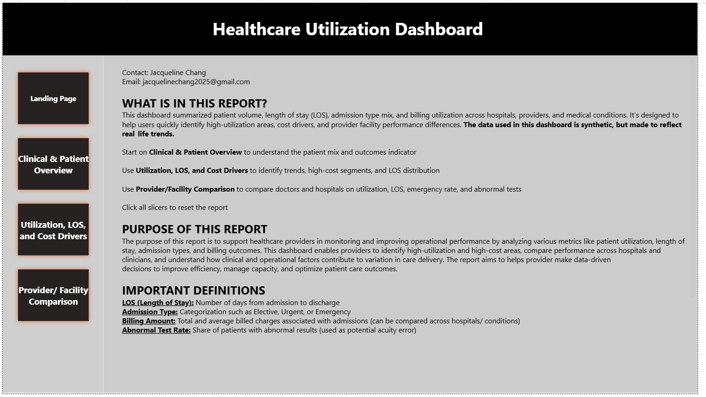
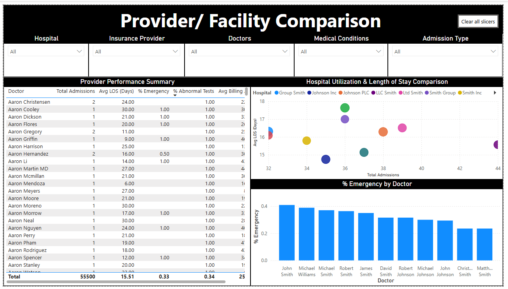

## Healthcare Utilization & Provider Dashboard

### Tools & Technologies
- Power BI  
- DAX  
- SQL (data preparation)

### Project Overiew
This project is an interactive dashboard created on Power BI that analyzes hospital utilization and provider workloard patterns, using encounter-level healthcare data. Each row in the dataset represents a single patient name, making the dataset is very granular and therefore allowing for a deeper and more nuances analysis from many perspectives. Healthcare organizations handle complex workloads across providers and departments, which can make it difficult to quickly identify utilization trends, and where pressure is building. 

The goal of the project is to allow stakholders identify patterns in patient volume, length of stay, and provider workload, and explore where operational strain and inefficiencies may exist. Stakeholders include operations managers, hospital administrators, and medical directors.  

This dashboard addresses the question: **How can hospital workload and utilization patterns be monitored to support data-driven operational decisions?**

### Data & Metrics
- Encounter-level healthcare data (one hospital visit is one observation) 
- Key metrics include:
  - Admissions volume 
  - Length of stay (LOS)
  - Provider workload
  - Utilization patterns by facility and service type

### Methods
- Data pre-processing
-   Deleted duplicated rows, irrelavent columns, and ensured correct data type 
- Built a multi-page **Power BI dashboard** with:
  - Interactive slicers and filters
  - Drill-through functionality for deeper analysis
  - Custom **DAX measures** to summarize utilization and workload metrics (average length of stay, median length of stay, 90th percentile of stay)
- Designed views to support both high-level monitoring and detailed operational review

### Results 
- Found that Emergency and Urgent encounters make up to ~66% of admissions, signaling a consistently high-acuity patient mix 
- Identified a gap between median LOS (~15 days) and 90th percentile LOS (~28 days), highlighting long-stay cases driving capactiy strain
- Revealed variation in LOS, billing, and admission volume across hospitals and providers, suggesting differences in case mix and resource utilization

## Dashboard Overview

### Landing Page

### Page 1: Patient Overview

### Page 2: LOS & Utilization

### Page 3: Provider Comparison

